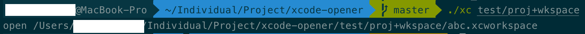
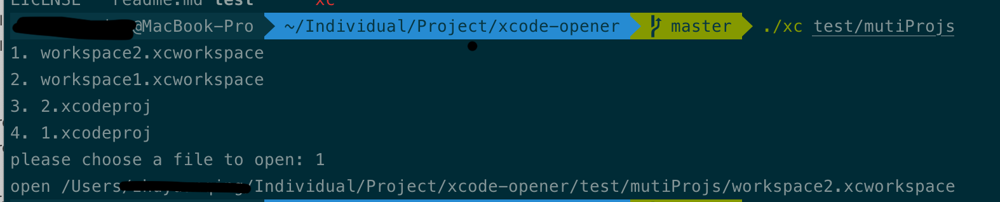

# xcode-opener
* A CLI tool that opens XCode project from Terminal. 
* Auto detect .xcodeproj file or .xcworkspace file. 
* You can use it to quickly open the new workspace generated by `pod install`. 
* it's fast

# Usage 
```
xc [<XCode_project_directory>]
```
## Example
1. specify folder explicitly
```shell
git clone git@github.com:SDWebImage/SDWebImage.git ~/GitHub
xc ~/GitHub/SDWebImage/Examples
```
2. open project/workspace of current folder without parameters
```shell
git clone git@github.com:SDWebImage/SDWebImage.git
cd SDWebImage/Examples
xc
```

# screenshot


# Prerequisite
Python 2.7+ or Python 3.5+

# Installation
An installation script is provided. 
```shell
bash ./install.sh
```
The only thing this script does is to copy the `xc` python file to `/usr/local/bin`. It's totoally OK if you'd like to do it manually. 
```shell
chmod +x ./xc
mv ./xc /usr/local/bin/
```

# Further fetures
1. `kill` subcommand
To kill all running XCode processes, equivalent to the following shell command. 
```shell
kill $(ps aux | grep 'Xcode' | awk '{print $2}')
```
2. `find` subcommand
To find all XCode project/workspace file(s) under the given directory. (search the directory tree recursively)

# Contribution
Any kind of contributions are welcome. If you have any requirements or you encounter any bugs, feel free to open an issue or create a PR.

# LICENSE
MIT @ zlrs
